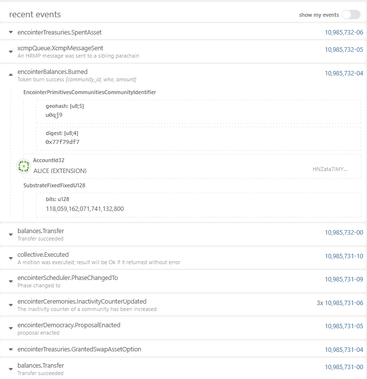
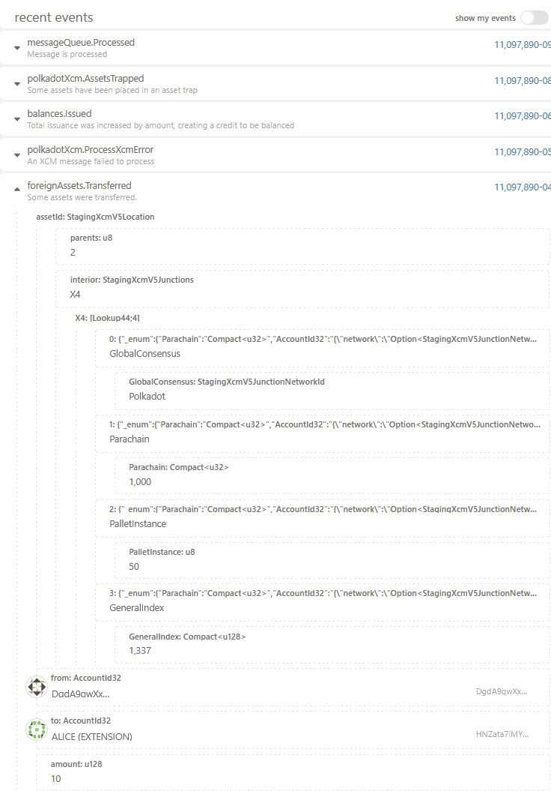

# Chopsticks Democracy Testing

The chopstick config does:

* ensure a well-known current ceremony index
* give voting eligible reputation for all communities to Alice
* ensure that community treasuries have funds on asset hub

## Tests

## Preliminaries

1. Build this encointer runtime with adapted democracy
   params (Note: the plan is to upstream this, so we do not need to maintain this
   branch): https://github.com/encointer/runtimes/tree/cl/fast-encointer-runtime:
   ` cargo build -p encointer-kusama-runtime --features fast-runtime`
2. `npx @acala-network/chopsticks@latest xcm --p=./chopsticks/encointer.yml --p=./chopsticks/asset-hub-kusama.yml`

### Test SpendAsset

1. [Submit a spendAsset proposal](https://polkadot.js.org/apps/?rpc=ws%3A%2F%2Flocalhost%3A8000#/extrinsics/decode/0x430009017530716a3977f79df7d43593c715fdd31c61141abd04a99fd6822c8558854ccde39a5684e7a56da27d40420f0000000000000000000000000005010100a10f0204090200a10f043205e514)
2. [Vote Aye](https://polkadot.js.org/apps/?rpc=ws%3A%2F%2Flocalhost%3A8000#/extrinsics/decode/0x43011b00000000000000000000000000000000047530716a3977f79df701000000)
   on the proposal with the current proposal id and use the reputation from the chopsticks config. (The proposal should
   immediately go into confirm)
3. We can immediately update the proposal states as the electorate is 1, and the confrim period 0.
4. go to next phase
   with [collectivePropose(encointerScheduler.nextPhase)](https://polkadot.js.org/apps/?rpc=ws%3A%2F%2Flocalhost%3A8000#/extrinsics/decode/0x3202043c00419c)
5. Double check events (See the end of the document to see what it should look like)

### Test IssueSwapAssetOption

1. [Submit an IssueSwapAssetOption proposal](https://polkadot.js.org/apps/?rpc=ws%3A%2F%2Flocalhost%3A8000#/extrinsics/decode/0x43000a7530716a3977f79df7d43593c715fdd31c61141abd04a99fd6822c8558854ccde39a5684e7a56da27d7530716a3977f79df705010100a10f0204090200a10f043205e51400e1f5050000000000000000000000000100d8a3703d0ad7a30000000000000000010000)
2. [Vote Aye](https://polkadot.js.org/apps/?rpc=ws%3A%2F%2Flocalhost%3A8000#/extrinsics/decode/0x43011c00000000000000000000000000000000047530716a3977f79df701000000)
3. We can
   immediately [update](https://polkadot.js.org/apps/?rpc=ws%3A%2F%2Flocalhost%3A8000#/extrinsics/decode/0x430220000000000000000000000000000000)
   the proposal states as the electorate is 1, and the confirm period 0:
4. go to next phase
   with [collectivePropose(encointerScheduler.nextPhase)](https://polkadot.js.org/apps/?rpc=ws%3A%2F%2Flocalhost%3A8000#/extrinsics/decode/0x3202043c00419c)
5. We see the event `GrantedSwapAssetOption` and we can see that Alice owns an option in the chain state.
6. Do
   a [encointerTreasuries.swapAsset](https://polkadot.js.org/apps/?rpc=ws%3A%2F%2Flocalhost%3A8000#/extrinsics/decode/0x44017530716a3977f79df70a000000000000000000000000000000)
   call
7. Correctly burned 6.4 Leu to get 10 USD

### Events Emitted during testing

Encointer (SpendAsset and IssueSwapOptionEvents):

Asset Hub Kusama (Transfer Assets Event):

